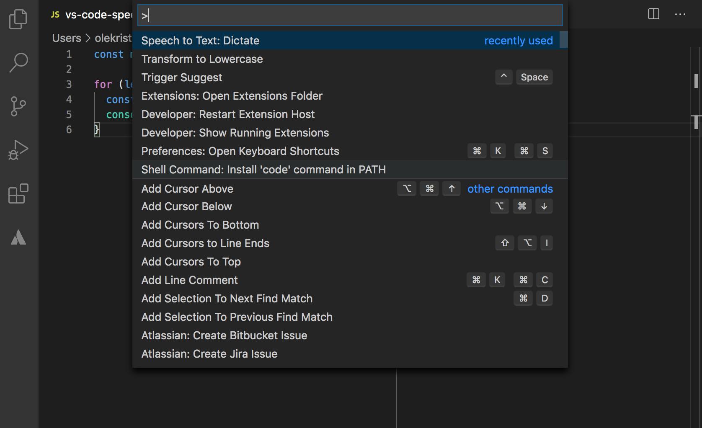
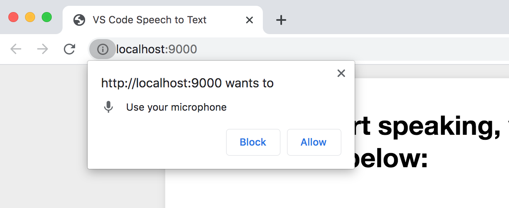
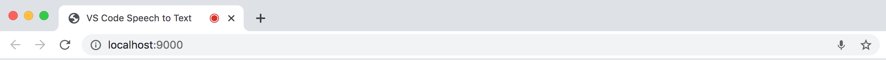
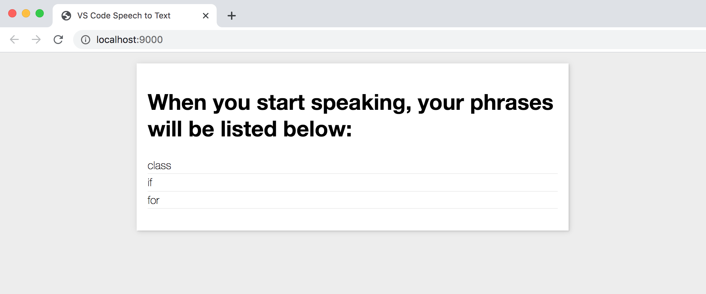
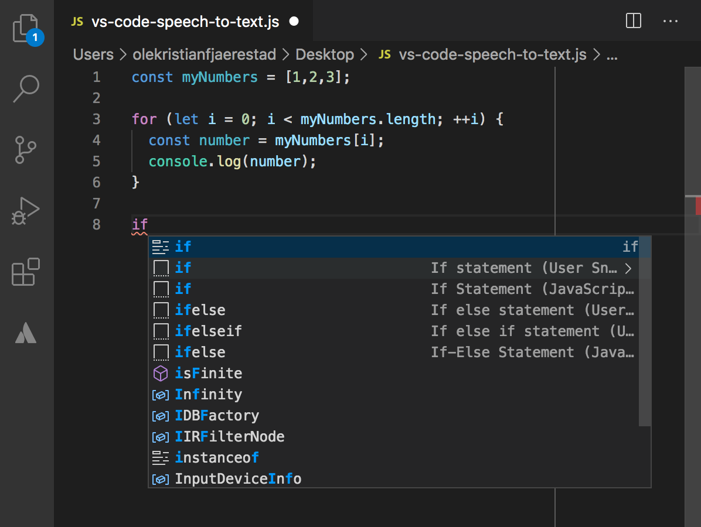

# vscode-speech-to-text README

Simple speech-to-text extension for Visual Studio Code.

## Features

Write code using your voice. Handy if you're not big on keyboards.

This is meant to be used in conjunction with [VS Code snippets](https://code.visualstudio.com/docs/editor/userdefinedsnippets). Speak a snippet, VS Code opens the IntelliSense suggestions dialog, then use your voice to select one of the suggestions. Certain VS Code [commands are also supported](#commands).

 <i>The command palette.</i>  

 <i>The extension will ask you for permission to use your microphone.</i>  

 <i>Address bar in Chrome when you've allowed access to your microphone.</i>  

 <i>Address bar in Chrome when you've denied access to your microphone.</i>  

 <i>The GUI. It's not here you want to spend your time anyway.</i>  

 <i>The IntelliSense suggestions dialog.</i>  

## Installation
TODO:

## Usage
1. `cmd/ctrl+shift+p` to open the command palette.
2. Run the `Speech to Text: Dictate` command. This will start a web server at `localhost:9000` and a WebSocket server at `localhost:9001`.
3. `localhost:9000` will automatically open in your default browser. If it doesn't, open it manually in Chrome or another browser that [supports the Web Speech API](https://developer.mozilla.org/en-US/docs/Web/API/SpeechRecognition#Browser_compatibility). This will connect to the WebSocket server and also ask for permission to use your device's microphone. You need to allow this to start using speech to text. Keep this page open (Note: keeping several tabs with this page open simultaneously could cause some hickups and is discouraged) and proceed to the next step.
4. Speak into your microphone. Each phrase you speak will be compared against a list of [predefined recognized phrases](#commands). If there's a match, it will trigger the corresponding command in VS Code. If not, it will simply output your phrase as text and trigger the IntelliSense suggestion dialog.

## Dev
1. `npm i`.
2. Open extension folder in VS Code.
3. Open the `Run` tab in the sidebar (`shift+cmd+D` on OSX) and click `Run Extension`.
4. A new VS Code `Extension Development Host` window will open. Open a file in this window and follow the Usage steps.
5. When you make any changes to the extension code, you need to refresh the `Extension Development Host` (`cmd+r` on OSX) for the changes to take effect. 

> Note: For changes to the code in the `client` folder to compile automatically, `npm run watchclient` must be ran in a separate terminal window.
> Note 2: If you have any compile errors in the `client` folder, step 4 won't work. In that case, run `tsc -p ./tsconfig.client.json` to see the errors you need to fix.

## <a name="commands">Commands</a>
Try speaking these commands and VS Code should perform according to the table:

| Command | Description |
| --- | --- |
| down | Move cursor down. |
| enter | Accept current IntelliSense suggestion. |
| left | Move cursor left. |
| next | Select next IntelliSense suggestion. |
| previous | Select previous IntelliSense suggestion. |
| right | Move cursor right. |
| up | Move cursor up. |

> Note: All other phrases will be output as text and trigger the IntelliSense suggestion dialog.

## Requirements

- VS Code running on a device with a microphone.
- Internet connection. The Web Speech API requires this. [See the note under Speech recognition](https://developer.mozilla.org/en-US/docs/Web/API/Web_Speech_API/Using_the_Web_Speech_API). The speed of the extension depends on the speed of your connection.
- A browser that [supports the Web Speech API](https://developer.mozilla.org/en-US/docs/Web/API/SpeechRecognition#Browser_compatibility).
- Available ports `9000` and `9001`.
- If you plan on developing the extension: [node.js and npm](https://nodejs.org/en/).

## Extension Settings

Include if your extension adds any VS Code settings through the `contributes.configuration` extension point.

For example:

This extension contributes the following settings:

* `myExtension.enable`: enable/disable this extension
* `myExtension.thing`: set to `blah` to do something

## Known Issues

- The speed of the extension depends on the speed of your connection. This is a limitation of the [Web Speech API](https://developer.mozilla.org/en-US/docs/Web/API/Web_Speech_API/Using_the_Web_Speech_API). Might be worth checking out other speech recognition alternatives.
- Compiling the `client` folder separately is tedious. Should look into a fix.

## Resources
- [https://developer.mozilla.org/en-US/docs/Web/API/Web_Speech_API/Using_the_Web_Speech_API](https://developer.mozilla.org/en-US/docs/Web/API/Web_Speech_API/Using_the_Web_Speech_API)
- [https://code.visualstudio.com/api/get-started/your-first-extension](https://code.visualstudio.com/api/get-started/your-first-extension)
- [https://css-tricks.com/what-i-learned-by-building-my-own-vs-code-extension/](https://css-tricks.com/what-i-learned-by-building-my-own-vs-code-extension/)
- [https://code.visualstudio.com/api/references/vscode-api](https://code.visualstudio.com/api/references/vscode-api)
- [https://code.visualstudio.com/api/references/vscode-api#WorkspaceEdit](https://code.visualstudio.com/api/references/vscode-api#WorkspaceEdit)
- [https://stackoverflow.com/questions/39569993/vs-code-extension-get-full-path](https://stackoverflow.com/questions/39569993/vs-code-extension-get-full-path)
- [https://github.com/microsoft/vscode/issues/111](https://github.com/microsoft/vscode/issues/111) (Extension API: cursor position (determining current location and moving it) #111)
- [https://github.com/Microsoft/vscode/issues/35000](https://github.com/Microsoft/vscode/issues/35000) (Trigger a Completion Item from key binding in vscode extensions #35000)
- [https://github.com/TalAter/annyang](https://github.com/TalAter/annyang) (Not currently using, but might be worth a look?)

## Release Notes

Users appreciate release notes as you update your extension.

### 0.0.1

Alpha. Just the most basic functionality.